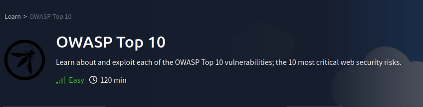

# Welcome

## Introduction

This covers the questions for [TryHackMe's OWASP Top 10 Room](https://tryhackme.com/room/owasptop10). Only the tasks with challenges will be covered and I suggest you go through the room for a deeper understanding of the vulnerabilities covered here. You should also check out the [OWASP Top Ten](https://owasp.org/www-project-top-ten/). 

!!! note "OWASP"
    The Open Web Application Security Project is a nonprofit foundation focused on understanding web technologies and exploitations and provides resources and tools designed to improve the security of software applications.

## Answers

!!! success "Task 5 Command Injection Practical - :fontawesome-solid-star::fontawesome-regular-star::fontawesome-regular-star::fontawesome-regular-star::fontawesome-regular-star:"
    Use [command injection](./objectives/o1.md) with knowledge of Linux tools to exploit the vulnerability.

!!! success "Task 7 Broken Authentication - :fontawesome-solid-star::fontawesome-regular-star::fontawesome-regular-star::fontawesome-regular-star::fontawesome-regular-star:"
    Insert [your answer](./objectives/o2.md) here.

!!! success "Task 11 Sensitive Data Exposure - :fontawesome-solid-star::fontawesome-regular-star::fontawesome-regular-star::fontawesome-regular-star::fontawesome-regular-star:"
    Insert [your answer](./objectives/o3.md) here.

!!! success "4. Insert Objective 4 Title - :fontawesome-solid-star::fontawesome-solid-star::fontawesome-solid-star::fontawesome-solid-star::fontawesome-regular-star:"
    Insert [your answer](./objectives/o4.md) here.

!!! success "5. Insert Objective 5 Title - :fontawesome-solid-star::fontawesome-solid-star::fontawesome-solid-star::fontawesome-solid-star::fontawesome-solid-star::fontawesome-solid-star:"
    Insert [your answer](./objectives/o5.md) here.

## Conclusion

Complete the report with Takeaways or a summary of the engagement.

