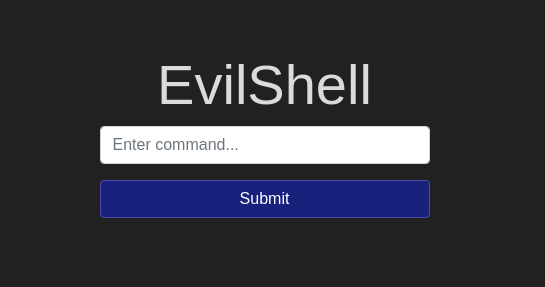
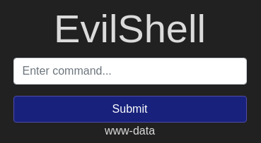
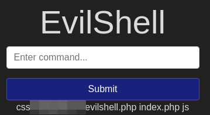
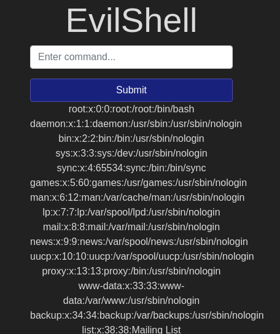
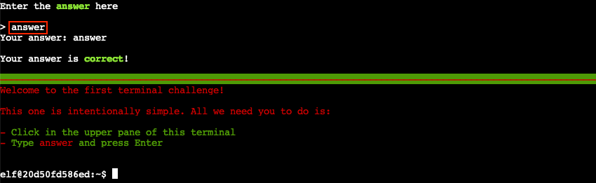
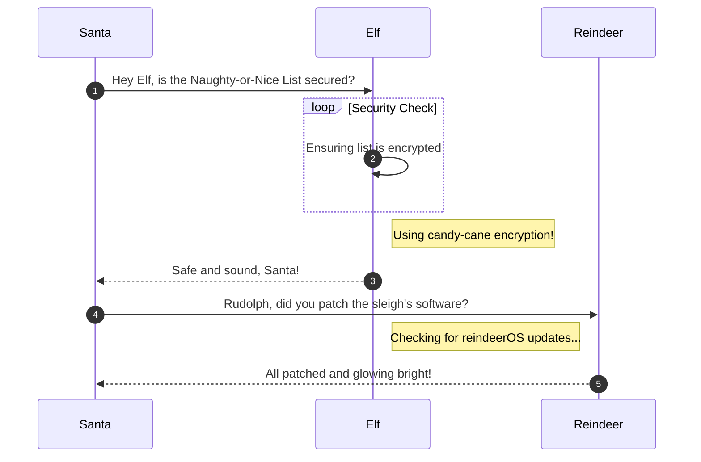

# Command Injection Practical

**Difficulty**: :fontawesome-solid-star::fontawesome-regular-star::fontawesome-regular-star::fontawesome-regular-star::fontawesome-regular-star:<br/>

## Objective

!!! question "Request"
    Detect and exploit the Active Command Injection found on the target machine.

Task 5 is the first task with questions to answer. In the previous tasks, we covered what an injection is from a cybersecurity perspective, and some of the various types.

## Solution

Task 5 is specifically concerned with teachin Command Injection. After some discussion about what Active Command Injection is and how it could happen, we are presented with a list of commands to try for Linux or Windows vulnerability testing. 


/// caption
Remember that just because 1 doesn't work, doesn't mean they all are blocked
///

After starting the machine and navigating to the provided IP, there is a single input field:


/// caption 
///

Going off the hint of commands to try, we can start with `whoami`. Entering that into our input field gives us an output of `www-data` as if we were inputting it directly to a terminal prompt.


/// caption
///

Now that we have confirmed that there is a command injection vulnerability, we can began exploring for our answers. 

!!! quesiton "What strange text file is in the website root directory?"
    To list the contents of a directory we can use the **list** command `ls` 


/// caption
Enter the file found here in the room. 
///

!!! question "How many non-root/non-service/non-daemon users are there?"
    use `cat /etc/passwd`

This is a bit of a trick question. I had to look up different ways to determine if a user was a service or daemon. This [site](https://www.cyberciti.biz/faq/understanding-etcpasswd-file-format/) was a helpful refresher, particularly the `/etc/passwd` format.<br/>

| oracle:    | x:         | 1021:           | 1020:            | Oracle user:           | /data/network/oracle: | /bin/bash       |
| :--------- | :--------- | :-------------- | :--------------- | :--------------------- | :-------------------- | :-------------- |
| `Username` | `Password` | `User ID (UID)` | `Group ID (GID)` | `User ID Ingo (GECOS)` | `Home directory`      | `Command/shell` |


/// caption
///

We can look through the returned `/passwd` file searching for a `User ID (UID)` (column 3) over 1000 since the IDs below 1000 are typically reserved for system and service accounts. We can also look for valid login shells such as `/bin/bash` or `/bin/zsh`.

!!! info "Linux Fu"
    If you are unfamiliar with basic Linux commands and file structure, it can be very useful to spend some time learning those skills. 

!!! success "Count the users who do not belong to the system"
    Don't doubt yourself.

!!! question "What user is this app running as?"
    What command will tell you what account you are logged in as?


### Images



### Diagrams



### Code blocks

```bash linenums="1" hl_lines="7" title="Countdown script (with line 7 highlighted)"
#!/bin/bash
echo "Christmas Holiday Countdown"

days_until_xmas=$(($(date -d "Dec 25" +%j) - $(date +%j)))

if [ $days_until_xmas -ge 0 ]; then
  echo "Only $days_until_xmas days until Christmas!"
else
  echo "Christmas has passed! Hope you had a great time!"
fi
```

### Tables


!!! success "Answer"
    Insert the answer to the objective here.

## Response

!!! quote "Insert Character Name"
    Copy the final part of the conversation.
