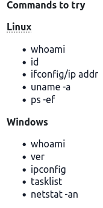
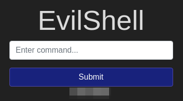

# Command Injection Practical

**Difficulty**: :fontawesome-solid-star::fontawesome-regular-star::fontawesome-regular-star::fontawesome-regular-star::fontawesome-regular-star: 
**Direct link**: [OWASP Top 10](https://tryhackme.com/room/owasptop10)

## Objective

!!! question "Command Injection"
    Detect and exploit the Active Command Injection found on the target machine.

Task 5 is the first task with questions to answer. In the previous tasks, we covered what an injection is from a cybersecurity perspective, and some of the various types, including SQL injection and command injection.

## Solution

Task 5 is specifically concerned with teaching Command Injection. After some discussion about what Active Command Injection is and how it could happen, we are presented with a list of commands to try for Linux or Windows vulnerability testing. 

/// caption
Remember that just because 1 doesn't work, doesn't mean they all are blocked
///

After starting the machine and navigating to the provided IP, there is a single input field:

/// caption 
///

Going off the hint of commands to try, we can start with `whoami`. Entering that into our input field gives us an output of `www-data` as if we were inputting it directly to a terminal prompt.

/// caption
///

Now that we have confirmed that there is a command injection vulnerability, we can began exploring for our answers. 

!!! question "Task 5.1"
    What strange text file is in the website root directory?

/// caption
Enter the file found here in the room. 
///

??? success "List Files"
    To list the contents of a directory we can use the **list** command `ls`.

!!! question "Task 5.2"
    How many non-root/non-service/non-daemon users are there?

This is a bit of a trick question. I had to look up different ways to determine if a user was a service or daemon. This [site](https://www.cyberciti.biz/faq/understanding-etcpasswd-file-format/) was a helpful refresher, particularly the `/etc/passwd` format. 

| oracle:    | x:         | 1021:           | 1020:            | Oracle user:           | /data/network/oracle: | /bin/bash       |
| :--------- | :--------- | :-------------- | :--------------- | :--------------------- | :-------------------- | :-------------- |
| `Username` | `Password` | `User ID (UID)` | `Group ID (GID)` | `User ID Ingo (GECOS)` | `Home directory`      | `Command/shell` |

/// caption
///

We can look through the `/passwd` file searching for a `User ID (UID)` (column 3) over 1000 since the IDs below 1000 are typically reserved for system and service accounts. We can also look for valid login shells such as `/bin/bash` or `/bin/zsh`.

!!! info "Linux Fu"
    If you are unfamiliar with basic Linux commands and file structure, it can be very useful to spend some time learning those skills. 

??? success "Count the users who do not belong to the system"
    Use `cat /etc/passwd` to list the profiles.

!!! question "Task 5.3"
    What user is this app running as?

Since I already tested for the command injection with the `whoami` command, I can just use that response here!

/// caption
Part of an investigation is documentation. Be sure to take notes because you never know when something you found previously by happenstance is the exact piece of the puzzle that you're missing.
///

!!! success "Current User"
    Use the `whoami` command to list the current user's username.

!!! question "Task 5.4"
    What is the user's shell set as?

Using the format layout above and the results of the user list, we find the user from the previous question and check the last column to find what the shell is set as. 

??? success "User's shell"
    Use `cat /etc/passwd | awk -F: '{print $1, $7}'` to list the first and last column. Then find the username and copy/paste the answer.

!!! question "Task 5.5"
    What version of Ubuntu is running?

To answer this we will need to know how to list versions of our operating system. Since the question was kind enough to give the operating system as Ubuntu, it is possible to search specifically for the Ubuntu preferred method. There are a number of ways that the version of an operating system can be found from a command line and this [link](https://www.geeksforgeeks.org/how-to-check-the-os-version-in-linux/) list 5 different ones that can be used. 

??? success "Version"
    I used `lsb_release -a` to list the correct version.

!!! question "Task 5.6"
    Print out the MOTD.  What favorite beverage is shown?

This question called for some research to learn what the *MOTD* is as well as the various ways to interact with it. First, I checked the hint, which wasn't initially helpfull.

??? tip "Hint"
    00-header

I start like most initial research; a Google search. Looking up what the "motd" is in reference to Linux brought me [here](https://www.man7.org/linux/man-pages/man5/motd.5.html) to explain that "motd" is an abbreviation for "Message Of The Day". This is a message that is displayed after a successful login but just before the login shell is executed by `login(1)`. Digging further, I found various references to the `motd` file and how to view it. Turns out Ubuntu is a little different from other distros, as mentioned [here](https://askubuntu.com/questions/800928/where-is-motd-on-modern-ubuntu-systems). Using the file path from the answer on that link, and the hint, we can find and read the correct MOTD message.

??? success "Makes the world taste better"
    Use `ls /etc/update-motd.d/` to find the list of files. Use `cat` again to read the file from the hint. 

/// caption
Using the `list` tool, our hint makes more sense
///

/// caption
The output of `cat` has the answer needed.
///

That completes this write up. Next up will be [Broken Authentication](./o2.md). 