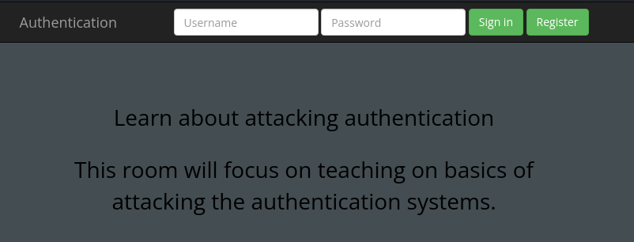
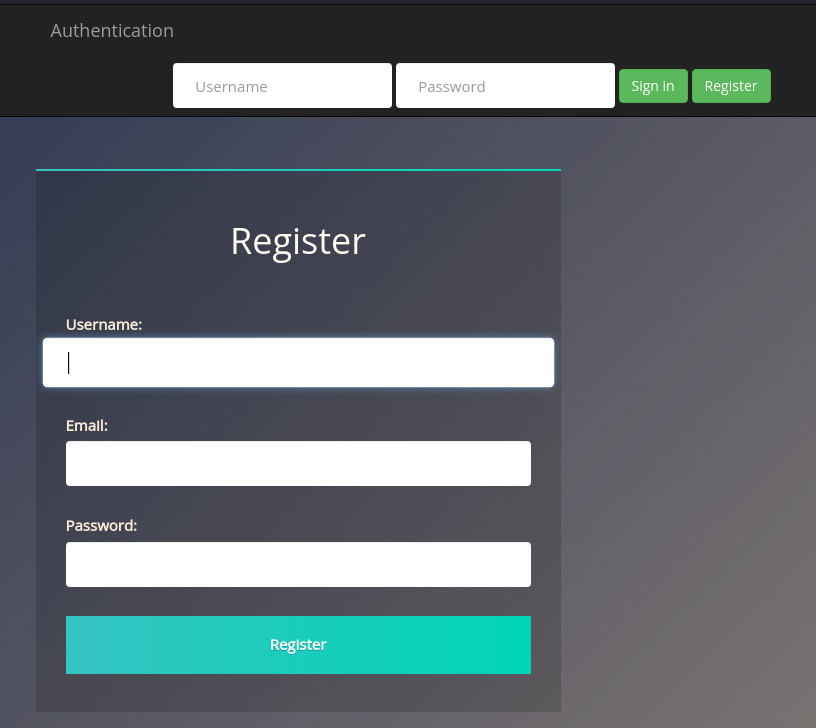
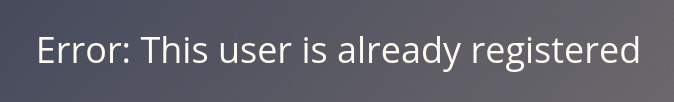
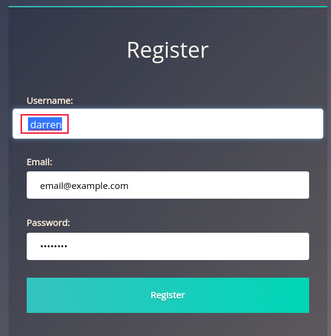
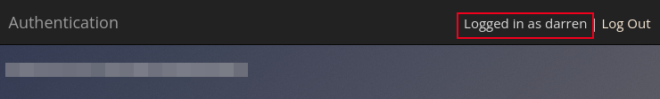
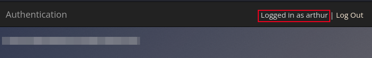

# Broken Authentication

**Difficulty**: :fontawesome-solid-star::fontawesome-regular-star::fontawesome-regular-star::fontawesome-regular-star::fontawesome-regular-star: 
**Direct link**: [TryHackMe - OWASP](https://tryhackme.com/room/owasptop10)

## Objective

!!! question "Task 7 Exploit Broken Authentication"
    Explore a logic flaw within the authentication mechanism.

!!! info "Scope"
    Once again, I wont be reposting what can be read in the room. TryHackMe's free resources are invaluable and I highly recommend checking it out for yourself. 

This task starts out seeming to give the steps laid out pretty clearly. Start the machine and navigate to the IP address that is provided. 

///caption
Select Register to create an account
///

??? warning "Correct VM"
    Each task has a specific target machine. Be sure to terminate the machine from task 5 before trying to spin up the machine for task 7

## Solution

Following the instructions, I first attempt to register an account with the username 'darren'. 

/// caption
Remember the password you use to create the account
///

/// caption
Expected error when trying to register an existing account name.
///

Now we try " darren". There isn't a success message but we don't get the error. Lets try logging in with " darren" and the password we used. 

/// caption
This is one example of Broken Authentication
///

!!! request "Task 7.1"
    What is the flag that you found in darren's account?

??? success "darren"
    I was unable to copy/paste direcctly from the account. I used dev tools too inspect the page and copy the flag from the "Elements" page. 
    

!!! request "Task 7.2"
    What is the flag that you found in arthur's account?

We are given a second account, "arthur", to try the same technique on. Once again we use a space or null character before a known account name to try re-registering an existing account. 

??? success "arthur"
    Register the account name " arthur", then log in with " arthur" and the password you created. 
    

This task and room covered a single Broken Authentication example. You can dig further with this [OWASP Cheat Sheet](https://cheatsheetseries.owasp.org/cheatsheets/Authentication_Cheat_Sheet.html). The next vulnerability on our list is **Sensitive Data Exposure**. [Follow along](./o3.md).
