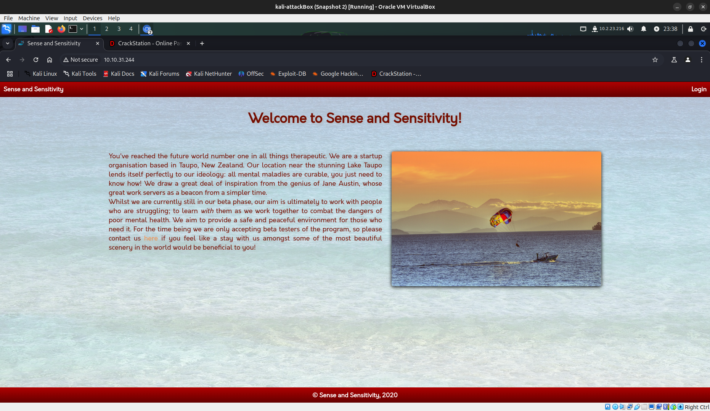
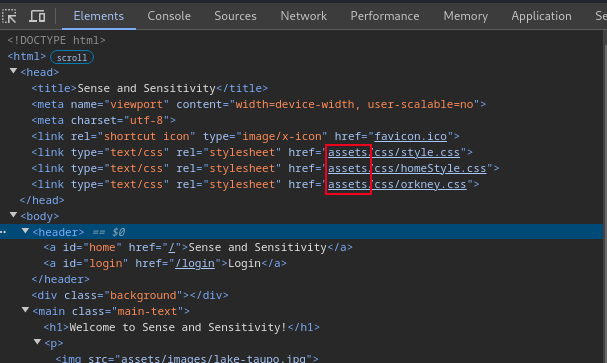
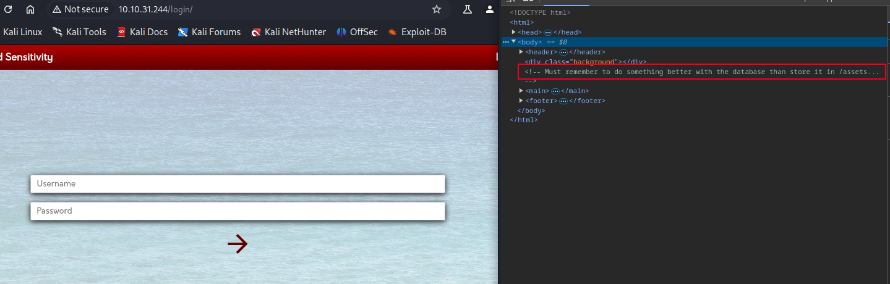
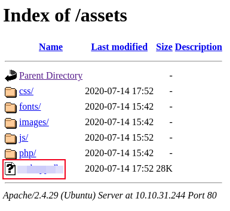
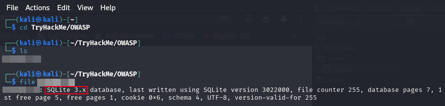
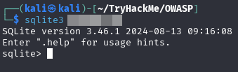
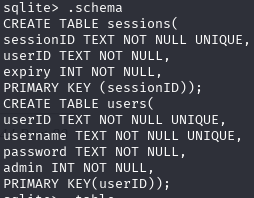
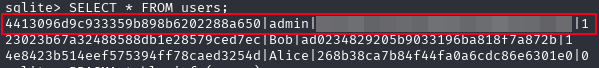
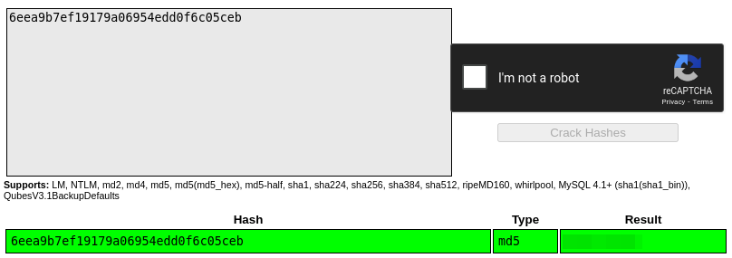
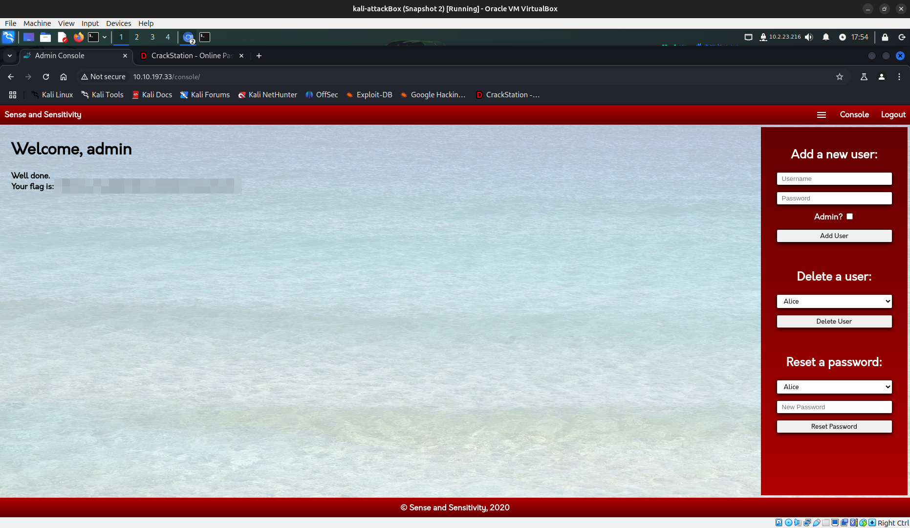

# Sensitive Data Exposure

**Difficulty**: :fontawesome-solid-star::fontawesome-regular-star::fontawesome-regular-star::fontawesome-regular-star::fontawesome-regular-star: 
**Direct link**: [TryHackMe - OWASP](https://tryhackme.com/room/owasptop10)

## Objective

!!! question annotate "Sensitive Data Exposure (1)"
    Explore the target web application for exposed sensitive data.

1.  I am only presenting my work to answer the questions associated with this room. I suggest going through the Tasks not covered here to fully understand the concepts being challenged. 

## Solution

Start by spinning up your target machine in Task 8, grab the IP and plug it into the browser of your choice; I am using Chromium in my Kali box. 

/// caption
///

!!! question "Task 11.1"
    What is the name of the mentioned directory?

Looking around, the first thing I do is inspect the page Elements using DevTools. Immediately we can should take note that we have an "assets" endpoint we might be able to target. For now, I make a note of it and continue to explore. 

/// caption
Make a note of endpoints for future enumeration
///

Not much else to see for this challenge. Moving over to the login there is a comment for us. 

/// caption
Submit the mentioned directory.
///

??? success annotate "Directory"
    Submit "assets" for this answer.

!!! question "Task 11.2"
    Navigate to the directory you found in question one. What file stands out as being likely to contain sensitive data?

Following the breadcrumbs, navigate to the directory and we see the flat-file mentioned in the reading, which should also be the answer to our next question. 

??? success "Interesting File"
    Submit the interresting files' name to answer the question.

/// caption
This is our target file.
///

!!! question "Task 11.3"
    Use the supporting material to access the sensitive data. What is the password hash of the admin user?

With the file just sitting there, nothing is stopping us from right-click and select "Save link as...". Choose the directory that you are working from. 

!!! warning "Download"
    Watch for a notification that the download was blocked. Tell your browser that the download is safe to proceed.

Once we have it, we can use the same commands from the reading as well as some of our Linux Fu to begin exploring. Navigate to the directory that the file we found was saved in and use the `file` command to inspect it. 

/// caption
`file` can be used to determine the type of file. We see the one we found is "SQLite 3.x database"
///

Since the file is a database flat-file, we will want to explore it further with a database manager. Since we know the database was written using SQLite, and it is available out-of-the-box on Kali Linux, we can use the `sqlite3 <database.db>` command.

/// caption
Use `sqlite3` to manage the database found
///

The first thing I do when accessing a new database is `.schema`. This allows me to view the structure of the whole database. 

/// caption
We have two tables; `sessions` & `users`
///

We are looking for the hash of the admin user's password; it looks like the `users` table is going to have the relevant fields. To check out the whole table use `SHOW * FROM users;`.

/// caption
Pay attention to the layout. The userID looks like a hash as well, but we need the password hash
///

There are 3 accounts listed; admin, Bob, and Alice with a potentially hashed `userID` and a hashed `password`.

| userID                           | username | password                         | admin |
| :------------------------------- | :------- | :------------------------------- | :---- |
| 4413096d9c933359b898b6202288a650 | admin    | REDACTED                         | 1     |
| 23023b67a32488588db1e28579ced7ec | Bob      | ad0234829205b9033196ba818f7a872b | 1     |      
| 4e8423b514eef575394ff78caed3254d | Alice    | 268b38ca7b84f44fa0a6cdc86e6301e0 | 0     |

??? success "Admin Hash"
    Copy and paste the hash from column 3.

!!! question "Task 11.4"
    Crack the hash. 
    What is the admin's plaintext password?

??? success "Cracked Hash"
    The read through told us how to do this, so take the password hash over to [CrackStation](https://crackstation.net/), paste the answer from Task 11.3, complete the CAPTCHA, and crack the hash.

/// caption
There are many resources for password cracking, but CrackStation is an ideal online resource.
///

!!! question "Task 11.5"
    Login as the admin. What is the flag?

??? success "Log in"
    This is straightforward. We have a username and password to use at the login page, which shows us a "Welcome, admin" page.

/// caption
Success!
///

### Wrap Up

This exploit was a bit more involved, however it also built off some of the previous knowledge. Lets move on to the next challenge. Read the appropriate tasks and I'll meet you in the challenges for [XML External Entity](./o4.md).