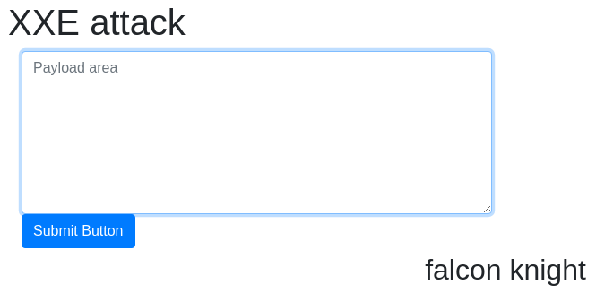
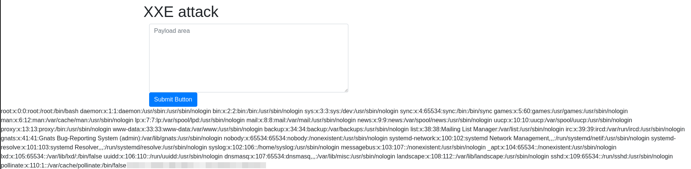
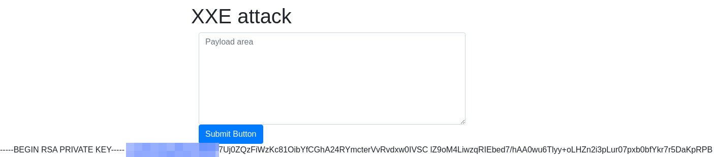

# XML External Entity (XXE)

**Difficulty**: :fontawesome-solid-star::fontawesome-regular-star::fontawesome-regular-star::fontawesome-regular-star::fontawesome-regular-star:<br/>
**Direct link**: [TryHackMe - OWASP](https://tryhackme.com/room/owasptop10)

## Objective

This topic is labeled "Severity 4" and provides more information, as well as questions about the readings. Read through the pages explaining `xml` and its importance before answering the related questions. This particular write-up will be covering task 13 through 16 questions.

## Solution


### Task 13

!!! question "Task 13.1"
    Full form of XML

??? success "XML Definition"
    Copying directly from the reading, I found that XML is the abbreviation for "Extensible Markup Language"

!!! question "Task 13.2"
    Is it compulsory to have XML prolog in XML documents?

??? success "XML Prolog"
    Reading the **Syntax** section, we can see the following in regard to XML prolog: "This line is {==not compulsory==} to use but it is considered a 'good practice' to put that line in all your XML documents."

!!! question "Task 13.3"
    Can we validate XML documents against a schema?

??? success "XML Validation"
    Again, the answer can be found in the reading. Specifically, point *3* in the section **Why we use XML** states "XML allows validation using DTD and Schema."

!!! question "Task 13.4"
    How can we specify XML version and encoding in XML document?

??? success "XML Specification"
    Reading through the task we can clearly see the answer "...it specifies the XML version and the encoding used in the XML document." Paste it into the answer blank and move on to Task 14.

### Task 14

!!! question "Task 14.1"
    How do you define a new ELEMENT?

??? success "ELEMENT"
    To define a new element, we can see that `!ELEMENT` is used in the DTD.

!!! question "Task 14.2"
    How do you define a ROOT element?

??? success "ROOT"
    `!DOCTYPE` defines a root element.

!!! question "Task 14.3"
    How do you define a new ENTITY?

??? success "ENTITY"
    This is a little bit of a trick question since 'ENTITY' isn't listed in this specific reading. However, we can use pattern recognition to make an educated guess about how an ENTITY might be defined based on the way other definitions have been used. 

### Task 16

!!! question "Task 16.1"
    Try to display your own name using any payload.

??? success "Payload"
    No need to reinvent the wheel here; just use the provided payload in the "Payload area"<br/>
    

!!! question "Task 16.2"
    See if you can read the /etc/passwd

??? success "`/etc/passwd`"
    Again, the payload was provided. Use it to print the target.<br/>
    

!!! question "Task 16.3"
    What is the name of the user in /etc/passwd

??? success "User name"
    The previous command gave us the `/passwd` list so we can pull the user from it.

!!! question "Task 16.4"
    Where is falcon's SSH key located?

??? success "Location"
    This required some digging and trial and error. I kept trying to list the contents of the directory. Eventually, I managed to research standard naming convention `id_rsa`. Adding that allowed me to view the private key and verified the correct path.
    

!!! question "Task 16.5"
    What are the first 18 characters for falcon's private key

??? success "RSA"
    If you haven't done so already, use the same payload as that used to view `/etc/passwd` and change the file location.
    ```xml linenums="1" title="payload"
    <?xml version="1.0"?>
    <!DOCTYPE root [<!ENTITY read SYSTEM 'file:///home/falcon/.ssh/id_rsa'>]>
    <root>&read;</root>
    ```