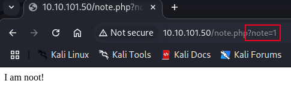

# Broken Access Control

**Difficulty**: :fontawesome-solid-star::fontawesome-regular-star::fontawesome-regular-star::fontawesome-regular-star::fontawesome-regular-star: 
**Direct link**: [TryHackMe - OWASP](https://tryhackme.com/room/owasptop10)

## Objective

!!! question "Task 18"
    Read and understand how IDOR works.

## Solution

Read the documentation then spin up your target machine. Once it gives you an IP address, navigate to it and log in with the credentials provided.

/// caption
Make a note of the end of the URL
///

!!! question "Task 18.3"
    Look at other users notes. What is the flag?

I banged my head against this challenge for an excessive feeling amount of time because I got locked into an assumption. The vulnerability here is the ability to change the number of the note in the url without any validation. This allows the user `noot` to access any other user's notes. 

/// caption
Changing the note number allows us to navigate to that page.
///

This is where I made my mistake. Starting from "1", I manually changed the note to each number up to 10. Every page was blank so I tried putting it into BurpSuite to view the responses better. I started again with 1-10. Then I wrote a Python script to print 1-100 into a text file and used that as a payload for BurpSuite's Intruder feature. I still found nothing, but the search was rather quick, and the process seemed relatively easy; maybe the range was bigger to account for the ease? 
This time I changed my script to print 1-1,000, updated my payload in BurpSuite, and sat back to wait... By note 467 I figured I was probably wrong and headed down a rabbit trail.  
I checked other write-ups but couldn't find anything to point me in the right direction. Finally, after reaching out to the THM Discord page, it was pointed out that computer counting often begins with `0`. I kicked myself for a minute, then plugged it into the URL, grabbed the flag and pasted it in the challenge.

??? success "Notes"
    Change `?note=1` to `?note=0`
    

## Reflection

Once again, a minor detail reminds me that it is important to pay attention to details. Keep an open mind and don't make assumptions. Let's check the security misconfiguration vulnerability. Follow [along](./o6.md)