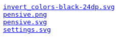

# Security Misconfiguration

**Difficulty**: :fontawesome-solid-star::fontawesome-regular-star::fontawesome-regular-star::fontawesome-regular-star::fontawesome-regular-star: 
**Direct link**: [TryHackMe - OWASP](https://tryhackme.com/room/owasptop10)

## Objective

!!! question "Task 19"
    Hack into the webapp, and find the flag!

## Hints

??? tip "Hint"
    Can you find the app's source code? Maybe the documentation gives you default credentials that you can try.

## Solution

Start the VM and then navigate to the provided IP address. We see a login screen for a note taking app called Pensive Notes. This challenge is specifically targetting misconfiguration security risks, so we don't strictly need to scan the IP address with nmap. I did fuzz using `ffuf` though it was ultimately just a rabbit trail. 

/// caption
Pensive Notes landing page
///

/// caption
We get four potential targets to explore using `big.txt` from SecList
///

   

I poked around each of these, and used DevTools to explore the "Source" code as the hint suggested. This is where this room is a bit different from other rooms or tasks I have completed with TryHackMe, where the resource isn't located within the material provided in the task. After digging through all of the various pages using DevTools and running into a brick wall every time, I started digging through some other write-ups until I saw a reference to GitHub. Searching for "Pensive Notes" with a search engine will point to a [GitHub page](https://github.com/NinjaJc01/PensiveNotes). 

/// caption
Another reminder to not make assumptions, even with training.
///

This then is the source code that the hint wanted us to find. Scrolling through the `README.md`, we can easily find the default log in information.

/// caption
Always conduct thorough recon
///

With the username and password combo, it's a simple matter of logging in to find the flag. 

/// caption
Have a flag!
///

!!! success "Default Credentials are a security risk!"
    Default credentials are a (surprisingly common) security flaw, especially with IoT (Internet of Things) Devices. 