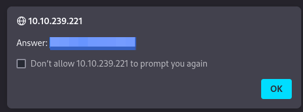
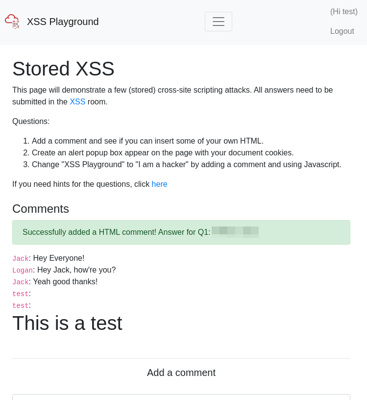

# Cross-site Scripting

**Difficulty**: :fontawesome-solid-star::fontawesome-regular-star::fontawesome-regular-star::fontawesome-regular-star::fontawesome-regular-star:<br/>
**Direct link**: [TryHackMe - OWASP](https://tryhackme.com/room/owasptop10)

## Objective

!!! question "Task 20"
    The VM attached to this task showcases DOM-Based, Reflected and Stored XSS. Deploy the machine and exploit each type!

## Hints

??? tip "Question 1 Hint"
    Take a look at some HTML tags [here](https://www.w3schools.com/html/default.asp).

??? tip "Question 2 Hint"
    You can get the pages documents using `#!javascript document.cookies` in Javascript<br/>
    If you right click on this page, and select "Inspect Element", it will open your browsers Development Tools. You can execute Javascript in the console tab.<br/>

??? tip "Question 3 Hint"
    Now you know you can execute Javascript directly on the webpage, you can use it to change elements on the page<br/>
    <br/>
    Try running this in your Developer Tools console `#!javascript document.querySelector('#thm-title').textContent = 'Hey'`

## Solution

!!! question "Task 20.1"
    Navigate to <IP ADDRESS> in your browser and click on the "Reflected XSS" tab on the navbar; craft a reflected XSS payload that will cause a popup saying "Hello".

This one we are able to find the payload in the reading. First, deploy the VM for this task and when the IP address is available, paste it in the browser of your attack machine and follow the prompt to select "Reflected XSS". 


/// caption
XSS Playground
///


/// caption
This page is where we will inject our script
///

??? success "Reflected XSS"
    Using the payload from the reading, inject the script in the search bar and hit "Search".
    ```javascript title="Payload" linenums="1"
    <script>alert("Hello")</script>
    ```


/// caption
The popup gives us the flag instead of our injected string
///

!!! question "Task 20.2"
    On the same reflective page, craft a reflected XSS payload that will cause a popup with your machines IP address.

??? tip "Hint"
    In Javascript window.location.hostname will show your hostname, in this case your deployed machine's hostname will be its IP.

So given the hint provided, we can craft a similar payload to the one we just sent, replacing "Hello" with `window.location.hostname` so it would look like this:

??? sucess "Script"
    Use this script to trigger a new flag.<br/>
    ```javascript title="Payload 2" linenums="1"
    <script>alert(window.location.hostname)</script>
    ```


/// caption
Reflected XSS exfiltrating information
///

!!! question "Task 20.3"
    Now navigate to <IP ADDRESS> in your browser and click on the "Stored XSS" tab on the navbar; make an account.<br.>
    Then add a comment and see if you can insert some of your own HTML.

So the first step is navigating to the "Stored XSS" page and registering an account.


/// caption
Account creation page
///

I used a generic `test:test` username and password to register an account which default logged me in.


/// caption
Logging in should take you to the "Stored XSS" submission page.
///

It helps to be familiar with HTML at this point, however it is not strictly necessary. If you are unfamiliar with HTML, you can read up about it more [here](https://www.w3schools.com/html/default.asp). You can also select the **hint** link that is on the page to see the clues listed above under **Hints**. 

So I tried using a simple test by using raw HTML in the comment section. 

??? success "Script"
    I submitted this to the comment section before reading through the hints. `#!html <h1>This is a test</h1>`. 


/// caption
Stored XSS
///

!!! request "Task 20.4"
    On the same page, create an alert popup box appear on the page with your document cookies.

This task seems to match the hint for question 2 from the "Stored XSS" page. Using the Dev Tools and Console, we can see the result of using the `document.cookie`.


/// caption
Now we can see the cookie
///

The instruction in the room however, says to create an alert popup. This means using the same Javascript injection we used earlier, combining it with the HTML script and trying to get the alert to pop on screen with the cookie. To do this I inserted my payload into the "Add a comment" section and sent it. 


/// caption
We can see that the popup matches the cookie shown in the Dev Tools. 
///

??? success "Script"
    Submit `#!javascript <script>alert(document.cookie)</script>` in the comment section. `#!javascript alert()` will trigger the popup while `#!javascript document.cookie` grabs the session cookie.<br/>
    Once we select "OK" the flag will also popup<br/>
    
    
!!! request "Task 20.5"
    Change "XSS Playground" to "I am a hacker" by adding a comment and using Javascript.


/// caption
This needs to be changed to "I am a hacker"
///

The hint for this one gives us the script or command we need to use. 


/// caption
`#!javascript document.querySelector('#thm-title').textContent = 'Hey'`
///

We can just plug in the phrase that is needed to trigger the flag with the script provided into the DevTools Console:

```javascript title="Provided Script" linenums="1"
document.querySelector('#thm-title').textContent = 'I am a hacker'
```


/// caption
The title was changed with the console
///

Unfortunately, this didn't actually trigger the flag. I tried refreshing the page with no success. So I tried once again with just submitting it as a comment on the page.

??? success "Script"
    Submit the HTML script as a comment to the page to trigger the flag.

