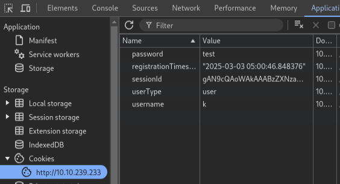
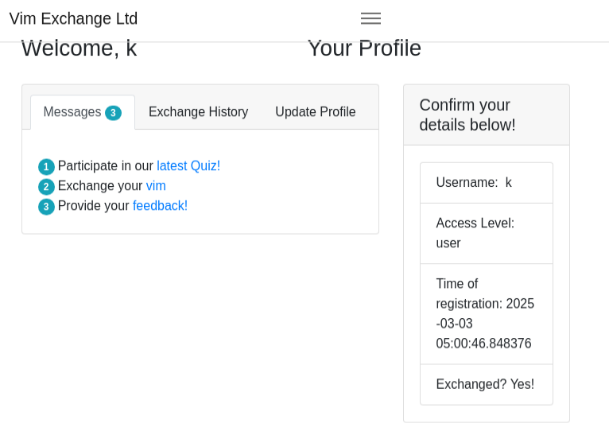
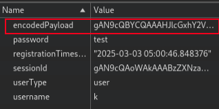
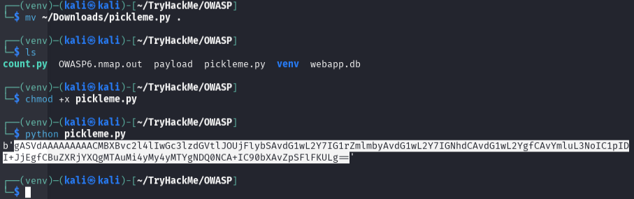
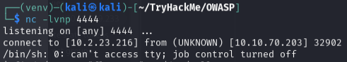
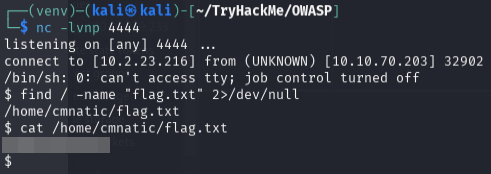

# Insecure Deserialization

**Difficulty**: :fontawesome-solid-star::fontawesome-regular-star::fontawesome-regular-star::fontawesome-regular-star::fontawesome-regular-star: 
**Direct link**: [TryHackMe - OWASP](https://tryhackme.com/room/owasptop10)

## Objective

!!! question "Task 26"
    Task 21 through 25 are reading tasks with questions that can be researched via the reading or online. Task 26 walks us through a simple exploitation of an Insecure Deserialization scenario

## Hints

??? tip "Task 21"
    When looking for who developed the Tomcat application, the answer is not the person's name. Find the orginization name instead.

!!! note "Spoilers"
    Once again, I will be focusing on the challenges that demonstrate the vulnerability without covering all of the reading and build up. I highly recommend that you read and answer all of the prompts for the preceding tasks.

## Solution

The steps for exploitation of this task seem straightforward so I wont be going into much detail here. Following the steps provided, we are able to establish Remote Controll Execution (RCE). 
The target machine should have been started to complete Task 25. If you are coming back to this, make sure to start the machine from Task 21. If you are continuing this task directly after completing task 25 then it is important to switch the `userType` value in the DevTools as the steps describes however, if you are starting this task after a break you can safely disregard step 1 and proceed to select the URL in "Exchange your vim".

 

With DevTools open to "Application", select the `vim` link and watch the `endocdedPayload` appear.

/// caption
payload delivered
///

Navigate to the "Feedback Form" as instructed. Scroll down on THM and download the `pickelme.py` to your working directory. Use `#!bash chmod +x pickleme.py` to make the script executable on your machine. 

The script needs to be edited to run properly; I used the code editor native in Kali to open the .py file and add the IP address of my attack box. Save the file and run it in your terminal. The instructions in the room refer to a GitHub repository and creating a .py file to copy the code to however this was not necessary at the time of this writing. 

/// caption
Download and execute the pickleme.py file
///

On your attack box, open your terminal with split screen in whatever way you are comfortable. I like to use top/bottom layout. In my top terminal, I started `netcat` with the recommended script `#!bash nc -lvnp 4444`. 

/// caption
netcat running on my attack box
///

After running `pickleme.py` copy the output and paste it into the `encryptedPayload` field of your DevTools. Refresh the page while watching the `netcat` terminal. You'll see the browser page hang and the netcat listener will give some output. This is the reverse shell that allows us remote controll access.

??? success "Find the flag"
    Once we have a reverse shell, we can use basic linux commands to find our flag. I used `#!bash find / -name "flag.txt" 2>/dev/null` to find the location. I then read the file with `cat`. 
    

## Wrap Up

This vulnerability does benefit from some foundational knowledge. It also can be much more involved to exploit. The tasks associated with this vulerability did a good job of introducing it. The next challenge involves components with known vulnerabilities. Follow the tasks associated with this vulnerability [here](./o9.md).